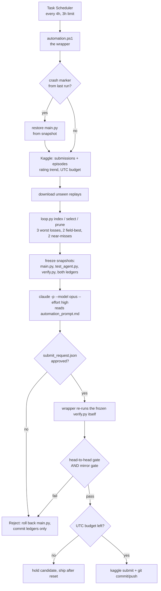

# How the loop works

A Windows scheduled task wakes every four hours, pulls what the public field did
to our live agent, hands the losses to Claude to form and test one hypothesis,
and ships the result only if an independently re-run benchmark agrees. Nobody has
to be at the keyboard. This file describes the machinery as of v11
(2026-08-12); `memory.md` describes what it has *learned*.

## The cycle

## Phases, and who owns each

| Phase | Owner | What actually happens |
|---|---|---|
| Schedule | Task Scheduler | `Kaggriculture Replay Optimizer`, every 4h from 16:00, `PT3H` limit, hidden PowerShell. A `Local\` mutex means two runs can never overlap. |
| Crash recovery | `automation.ps1` | `.automation/run_in_flight` is dropped in a `finally`, so it survives only a *killed* run. Finding it means the previous run died mid-edit, and `main.py` is restored from its snapshot before anything else. |
| Field state | `automation.ps1` | `kaggle competitions submissions/episodes`. The daily budget is counted from Kaggle's own UTC timestamps, not a local tally. Rating trend is logged every run. |
| Evidence | `automation.ps1` + `loop.py` | New replays are downloaded, indexed from their first 64KB (scores and team names serialise before `steps`, so a 17MB file is never parsed), then pruned to a 250MB corpus. |
| Selection | `loop.py select` | 3 worst losses + 2 highest-scoring opponent games + 2 near-misses. Deliberately not "all of them": averaging 20 wins in hid that the field's best game is twice ours. |
| Analysis | `claude -p` | Non-interactive, `bypassPermissions`, web tools denied. Reads `automation_prompt.md`, `memory.md`, `attempts.jsonl`, `run_context.json`, the selected replays. Edits `main.py` in place. |
| Verdict | `automation.ps1` | Re-runs the *frozen* `verify.py` against the *frozen* baseline. The agent's own reported numbers are never trusted. |
| Ship | `automation.ps1` | `kaggle competitions submit`, then `git add/commit/push` of code + ledgers. Over budget → the candidate is held for the UTC reset. |

## The two gates

Both are applied by the wrapper to numbers it measured itself.

- **Head-to-head** — `verify.py` at 4 seeds × 2 seats: ≥7/8 wins, mean final money
  ≥ +$100, every status `DONE`.
- **Mirror** — each agent plays *itself*; the candidate's mean must beat the
  baseline's by ≥$500.

The mirror exists because the head-to-head plays the candidate against a slower
copy of itself, which pays for merely *acting sooner* on anything shared. v7 won
7/8 at +$1,504, showed **+84** in the mirror, and lost 36 points of public
rating. Production survives a mirror; racing does not.

Four more checks sit beside them: `main.py` must differ from its snapshot, both
ledgers must have been updated, `py_compile` must pass, and `test_agent.py` must
pass. Any failure calls `Reject`, which rolls the code back and commits the
ledgers anyway — a rejected run is where most of the learning is.

## State, and what survives

| Artefact | Versioned | Regenerable | Purpose |
|---|---|---|---|
| `main.py` | yes | — | the agent |
| `memory.md` | yes | no | curated ledger, read in full every run |
| `decision.md` | yes | no | append-only archive, grepped not read |
| `attempts.jsonl` | yes | yes, from `decision.md` | "has this been tried?" in one line each |
| `replay_index.json` | **yes** | **no** | every episode ever scored; the raw replays behind it are deleted |
| `replays/` | no | by re-download | ~17MB each, pruned to 250MB after every run |
| `.automation/` | no | yes | state, snapshots, logs, `run_context.json`, `submit_request.json` |

`replay_index.json` is the one artefact here that cannot be rebuilt from
anything on disk — losing it costs a ~1.3GB re-download.

## Where it stands

- v11 live at **803.6** (14 episodes, still moving); v10 719.6, v6 665.4.
- Local mirror mean ~$114,800 a game; field best observed **$175,862**
  (wenjinyang).
- 41 experiments recorded in `attempts.jsonl`; 8 selected, the rest rejected
  with their mechanism written down.

## What this loop cannot see

1. **Self-play is not the field.** Both gates measure us against ourselves. They
   caught v7's racing gain, but they cannot tell us what a farm we have never
   played does. Every real jump — fertilizing wheat, strawberry at field scale,
   the opening herd rush — came from reading a *replay of a loss*, not from the
   benchmark.
2. **Ratings converge slower than the loop runs.** A run is 4 hours; a rating
   needs ~25-30 episodes to settle, and submitting retires an older agent. The
   binding constraint on shipping is convergence, not the 5-a-day budget.
3. **Kaggle auth is a silent single point of failure.** Every run opens with
   `kaggle competitions submissions`; if the CLI's OAuth session has lapsed the
   run throws on that first call and the whole four-hour cycle is lost with
   nothing but an `ERROR:` line in `.automation/automation.log`. This happened at
   2026-08-12 20:00. The OAuth access token in `~/.kaggle/credentials.json`
   expires ~18h after each refresh; a static token in `~/.kaggle/access_token`
   (or `KAGGLE_API_TOKEN`) does not expire and is what an unattended loop wants.
4. **A rejected run still costs a cycle.** Three failed experiments per
   invocation is the cap; after that the loop waits for new replay evidence.
5. **Single-seed differences are noise.** Both farms trade into one market, so
   any perturbation moves the whole price path. Four seeds screen; eight decide.
