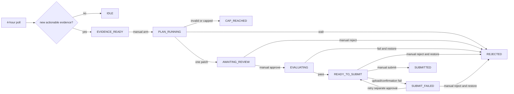

# Evidence-first optimization loop

The scheduled job is deliberately cheap. Every four hours it polls Kaggle,
downloads unseen replays, rebuilds compact evidence, persists status, and sends a
Windows notification. It cannot invoke Claude, modify `main.py`, benchmark, or
submit.

## Commands

```powershell
# Normally run only by Task Scheduler. -DryRun uses cached Kaggle responses.
.\automation.ps1 -Poll

# First check /usage yourself. This consumes the current evidence exactly once.
.\automation.ps1 -ArmPlan -ConfirmUsageAbove50

# Review .automation/proposals/<id>.md before choosing one of these.
.\automation.ps1 -ApprovePlan <id>
.\automation.ps1 -RejectPlan <id>

# A passing local candidate still cannot submit without this separate command.
.\automation.ps1 -SubmitCandidate <id>

# Find and update the existing action-path match, or create one current-user task.
.\automation.ps1 -InstallTask
```

`-NoNotify` suppresses toasts for diagnostics. It never suppresses durable state.

## State flow



Only `EVIDENCE_READY` can start a planning run. Its fingerprint is marked
consumed before Claude starts, so malformed output or a turn cap cannot loop on
the same packet. `AWAITING_REVIEW`, `EVALUATING`, `READY_TO_SUBMIT`, and
`SUBMIT_FAILED` block all
later planning; newer games queue behind the unresolved item.

## Token boundary

One manual arm sends only:

- current `main.py`;
- `memory.md`, capped at 12 KB;
- `.automation/evidence.json`, capped at 20 KB;
- the compact read-only proposal instructions.

The whole input is capped at 80 KB (roughly 20,000 tokens). Claude runs Sonnet at
medium effort, read-only, without session persistence, with structured output
and at most six turns. It may return one hypothesis and one exact `main.py`
patch, or say that evidence is insufficient. It never edits the workspace.

`decision.md` is a frozen historical archive and is absent from routine model
context. `attempts.jsonl` is the authoritative machine-readable index, including
all 108 imported top-level and nested historical attempts. New attempts retain
their queued, approved, tested, rejected/ready, and submitted transition history.

## Evidence

`loop.py` keeps at most three current-submission replay summaries: worst loss,
closest loss, and highest opponent score. The packet also contains aggregate
current and field records, one durable field ceiling, the observed competition
configuration, the ordered candidate backlog, and attempt records relevant to
wheat, shed/inventory pressure, and melon. Raw replays and the archive remain on
disk for deliberate lookup but are not loaded by default.

The candidate backlog is fixed in this order and candidates are never combined:

1. wheat-field cut;
2. shed pressure from shed plus carried inventory;
3. twelve-melon opening without purchase-priority changes.

## Evaluation and rollback

`verify.py` mirrors observed competition behavior with a town-center sell
interval of 24 and deterministic shop unlocks sampled with replacement. Every
result records its evaluator/configuration fingerprint and both code hashes.

Approval applies only the stored patch and only when `main.py` still matches the
stored baseline hash. It then runs syntax checks, `test_agent.py`, a four-seed
smoke screen (seeds 16–19), and twelve disjoint final seeds (0–11) across both
seats. The final gate requires:

- every status is `DONE`;
- mirror improvement is at least $1,000;
- median per-seed mirror delta is positive;
- head-to-head mean is no worse than -$500.

Any exception, crash, or failed gate restores the exact baseline. A kill during
evaluation leaves an in-flight record; the next invocation restores the baseline
before doing anything else. Exact historical calibration results and the seed
sensitivity caveat are recorded in [`EVALUATOR_BACKTEST.md`](EVALUATOR_BACKTEST.md).

## Durable files and notifications

- `.automation/status.json`: current state, message, fingerprints, active IDs;
- `.automation/state.json`: Kaggle submission/rating bookkeeping;
- `.automation/evidence.json`: current compact evidence packet;
- `.automation/proposals/<id>.md`: human review document;
- `.automation/proposals/<id>.json`: exact machine state and transition history;
- `.automation/candidates/<id>/`: baseline plus smoke/final results;
- `.automation/automation.log`: notification and operational failures.

Every poll sends a native Windows toast, including the no-action case. Toast
failure is logged and cannot erase any status, evidence, plan, or result.
